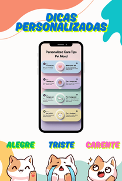
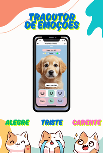
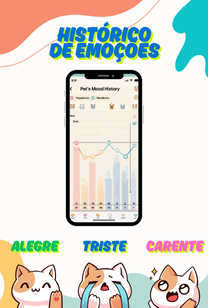

# 🐾 PetTalk

Aplicativo que traduz o humor de um pet.

## Descrição
O PetTalk é um projeto conceitual de aplicativo que identifica o estado emocional dos pets em tempo real, facilitando a comunicação entre tutores e seus animais de estimação.  
Com funcionalidade intuitiva, o app oferece insights, alertas e dicas personalizadas com base no comportamento do pet.

## Funcionalidades principais
- **Tradutor de Emoções**: detecta sinais do pet e os converte em informações compreensíveis.
- **Histórico de Humor**: registra as emoções ao longo do tempo.
- **Notificações Inteligentes**: alertas quando há alterações de humor.
- **Dicas Personalizadas**: sugestões baseadas no estado emocional do pet.

## Prints da Aplicação

### 🛎️ Notificações  

### 🎯 Interface de Dicas Personalizadas  

### 💬 Tradutor de Emoções  

### 📈 Histórico de Humor  

### 🧠 Cards de IA  

## Tecnologias Utilizadas
- HTML5 + CSS3  
- Bootstrap 5  
- Ferramentas de prototipação com IA

## Status do Projeto
✅ Finalizado como protótipo funcional de apresentação.

## Autor
Maycon Silva
